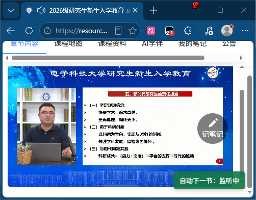

# UESTC 课程自动下一节助手

适用于电子科技大学教学资源管理平台的 Tampermonkey 用户脚本。

脚本会监听当前课程视频，并在视频正常播放结束后尝试进入下一课件。它适合减少重复点击操作，不会代替用户完成测验、作业或其他课程活动。

## 功能

- 视频播放结束后自动进入下一课件
- 进入下一视频后尝试自动开始播放
- 自动适配课程页面的动态加载
- 页面右下角常驻显示运行状态
- 支持通过状态条或 Tampermonkey 菜单启用、停用
- 不读取账号密码，不连接第三方题库服务

## 使用环境

- Chrome、Edge 等支持 Tampermonkey 的桌面浏览器
- Tampermonkey 扩展
- `https://resource.uestc.edu.cn/*` 下的课程页面

## 安装

1. 在浏览器中安装 Tampermonkey。
2. 打开 Tampermonkey 管理面板，选择“添加新脚本”。
3. 删除编辑器中的默认内容。
4. 复制 `uestc-auto-next.user.js` 的全部内容并粘贴到编辑器。
5. 按 `Ctrl+S` 保存，确认脚本开关处于启用状态。
6. 打开课程页面并按 `Ctrl+F5` 刷新。

如果 Tampermonkey 显示“URL 不匹配”，请确认脚本开头包含：

```javascript
// @match        https://resource.uestc.edu.cn/*
```

同时在浏览器的扩展管理页面中，允许 Tampermonkey 访问 `resource.uestc.edu.cn`。

## 使用方法

1. 打开“我的课程”并进入需要学习的课程。
2. 手动选择第一节视频并开始播放。
3. 确认页面右下角显示“自动下一节：监听中”。
4. 保持课程页面可见，等待视频正常播放结束。
5. 脚本会自动尝试进入下一课件，并在新播放器加载后开始播放。

点击右下角状态条，可以快速启用或停用脚本。也可以通过 Tampermonkey 菜单中的“切换自然结束后自动下一节”进行控制。

## 状态说明

| 状态 | 含义 |
| --- | --- |
| 等待视频 | 脚本已启动，但当前页面尚未检测到视频 |
| 监听中 | 已检测到当前视频，正在等待其播放结束 |
| 切换中 | 当前视频已结束，正在进入下一课件 |
| 等待新视频 | 已进入下一课件，正在等待播放器加载 |
| 播放中 | 下一课件已自动开始播放 |
| 请手动播放 | 浏览器阻止了自动播放，需要点击播放器 |
| 下一项无可播放视频 | 下一课件不是视频，或播放器未能在规定时间内加载 |
| 未找到下一课件 | 页面中没有可切换的下一项，或页面结构暂未适配 |
| 已停用 | 自动下一节功能已关闭，点击状态条可重新启用 |

## 已知不足

- 必须先手动选择并播放第一节视频。
- 平台可能在课程页面失去前台或不可见时暂停播放，脚本目前不能阻止这种暂停。
- 脚本会尝试自动播放下一视频，但浏览器的自动播放策略仍可能要求用户手动点击播放器。
- 仅处理视频结束后的课件切换，不会自动完成文档、测验、作业、考试或弹窗确认。
- 到达课程最后一项后不会继续跳转。
- 平台更新页面结构后，自动切换功能可能需要重新适配。

## 使用 DeskPins 保持窗口可见

由于平台要求课程页面保持在前台，可以尝试使用 Windows 上的 DeskPins 将课程窗口置顶：

1. 将课程页面单独打开在一个浏览器窗口中。
2. 启动 DeskPins。
3. 选择 DeskPins 的图钉工具，然后点击课程窗口。
4. 调整课程窗口大小，确保视频区域保持可见。
5. 不要最小化课程窗口，也不要在该窗口中切换到其他标签页。

DeskPins 只能帮助窗口保持置顶，无法保证兼容平台的所有前台检测方式。请从可信来源获取软件，并遵守平台和课程的使用要求。

## 常见问题

### 页面没有显示状态条

- 确认 Tampermonkey 中安装的是最新脚本并已经保存。
- 确认脚本处于启用状态。
- 检查浏览器是否允许 Tampermonkey 访问当前网站。
- 在课程页面按 `Ctrl+F5` 强制刷新。

### 一直显示“等待视频”

请进入具体视频课件并手动开始播放。如果播放器已经出现，可以刷新页面后重新进入该课件。

### 视频结束后没有进入下一项

按 `F12` 打开开发者工具，在控制台中搜索 `[UESTC Auto Next]`。提交问题时请附上：

- 当前课程页面 URL
- 状态条显示的内容
- 相关控制台日志
- 浏览器及 Tampermonkey 版本

请勿提交 Cookie、Token、密码或其他账号信息。

## 反馈与贡献

欢迎通过 GitHub Issues 提交兼容性问题或改进建议。提交代码前，请确认修改不会伪造学习进度、绕过测验或收集用户隐私信息。
